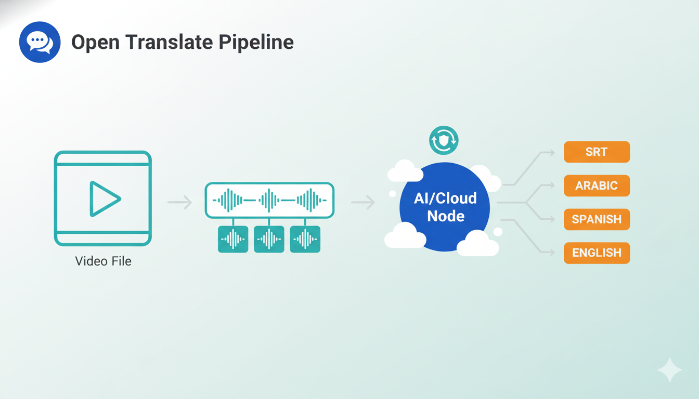

# Open Translate Pipeline

Generate accurate, timestamped subtitles from long videos by downloading (or using local media), extracting audio, splitting into segments, transcribing and translating with Gemini models, and assembling a final SRT. The pipeline is restartable at any step and is resilient to malformed model outputs.



## Features
- YouTube download via `yt-dlp` (local videos supported).
- Robust audio extraction to M4A, then fixed-duration segmentation.
- Minimal JSON transcription format with strict validation; retries and placeholders avoid empty ranges.
- Translation with model fallbacks, per-segment clamping, and monotonic SRT assembly with drift tolerance.
- Resume from split/transcribe/translate/assemble; concurrency control for faster runs.

## Setup
1) Activate env: `conda activate ST`
2) Install deps: `pip install google-generativeai yt-dlp`
3) Install ffmpeg.
4) Export `GEMINI_API_KEY` in your shell (no `.env`).

## Configuration (`config.json`)
- `path_to_vid`: YouTube URL or local video path.
- `source_language` / `target_language`: e.g., "Arabic", "Mexican Spanish".
- `output_dir`: Root for runs (default `output_srt`).
- `tmp_dir`: Temp segment folder name inside the run.
- `cleanup`: true/false to delete temp segments after assembly.
- `min_segment_minutes`: Minimum segment length (e.g., 5 or 10).
- `transcription_models`, `translation_models`: Lists of Gemini model ids.
- `concurrency`: Max parallel segments for transcription/translation (e.g., 5).
- Retry/timeout knobs: `transcribe_timeout_s`, `translate_timeout_s`, `translate_max_retries`, `transcribe_retry_wait_s`, `translate_retry_wait_s`, `transcribe_max_attempts`, `translate_max_empty_attempts`.
- `start_step`:
  - 0 download
  - 1 split
  - 2 transcribe
  - 3 translate
  - 4 assemble

## Run
1) Edit `config.json`.
2) `conda run -n ST python main.py`
3) Outputs land in `output_dir/<video_base>/`:
```
output_srt/
  <video_base>/
    extracted_audio/<video_base>.m4a
    tmp_segments/seg_*.m4a
    raw/segment_{i}_raw.txt
    translated/segment_{i}_translated.txt
    offsets.json
    <video_base>.srt
```

## Reliability notes
- Timestamp parsing accepts `XmYsZms` and `HH:MM:SS,mmm`.
- Malformed/empty transcriptions are retried; persistent failures write placeholders (and persist to `raw/`).
- Translations clamp to each segment’s duration; any overlaps are allowed up to 200 ms before being pushed forward. Assembly logs clamp/monotonic adjustments.
- Resume expects a run folder named after the video base (with `offsets.json` + durations). If not found or incomplete, a fresh split is performed.
